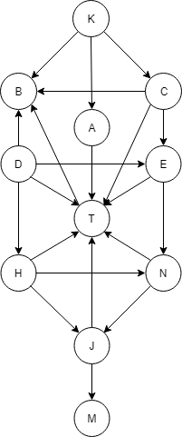

# Challenges for Discrete Math
This is a collection of challenge for a Discrete Math subject that I got in the bootcamp course, Coder Academy.

## Sets
## Big O
## Matrix
## Graphs

### *Challenge: Trees*
We need a way of storing the head of the tree (The node at the top of the chain without a parent), so maybe now we need to make a class which uses nodes to construct a tree.

If you want to try and make a binary tree class; lets aim for it to do the following:  

For each node added, if it's < the parent it is being added to the left. 

For each node added, if it's > the parent it is being added to the right. 

Have a function for inserting new nodes into the tree, to be in the correct location as mentioned above.  

Have a function for finding a node of a given value in the tree
I've completed this question

### *Challenge: Graphs*
Have a crack at making a digraph edgelist from the following graph.

Cool now lets try and make a graph class where we can enter edges or nodes and it will construct an edge list. Include functions such as adding an edge, deleting an edge, checking if a given edge exists, and printing a table/matrix representation.
There are an enourmous number of applications of graphs if you have eyes for it. For example mappling user use patterns on websites by the links they click, or working out the fastest way to send some data over a network, or create a social network.

If you want to see something really wild, check out Dijkstra's Algorithm. [Computerphile does a really good video explaining this](https://www.youtube.com/watch?v=GazC3A4OQTE). Try it out on the above digraph (The one with the costs)

## Functions & Relations

### *Challenge*

Now that you've tried those; try drawing out a relation matrix for *t ≤*, and then write down which of the above properties you think it can have.  

Can you think of a real world example of something that could meet all three properties?  

### *Answer*
*t ≤*

            v
          1 2 3
       1 ⎡∘ ∘ ∘⎤
    t  2 ⎢∙ ∘ ∘⎥
       3 ⎣∙ ∙ ∘⎦

       